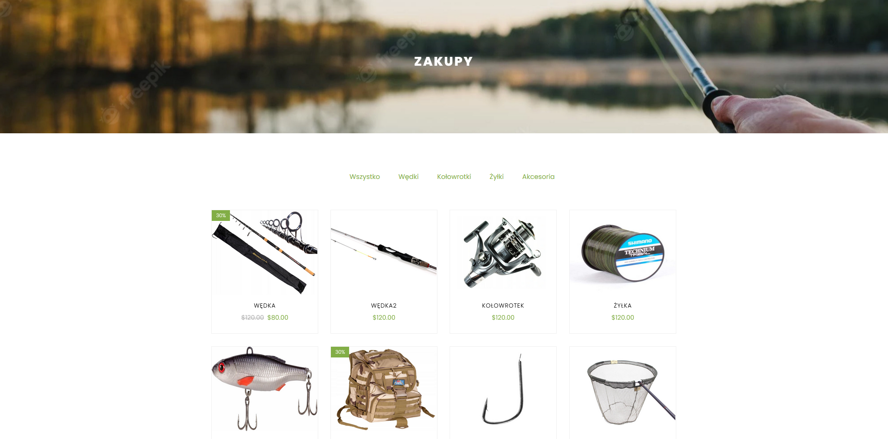
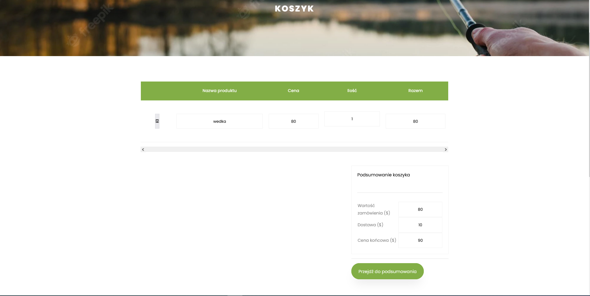
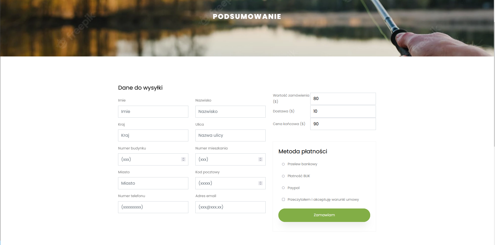

# WebShop

Web shop created using Laravel.

## Installation

To be able to run the project, you need to download and install the following:
1. [Xampp](https://www.apachefriends.org/pl/download.html) - Includes PHP language (Apache and PhpMyAdmin).
2. [Composer](https://getcomposer.org/download/)
3. [Node.js](https://nodejs.org/en/download/)
4. Laravel - After installing Composer, run the following command in CMD: 'composer global require laravel/installer'
5. Project files - Extract the files to the `htdocs` folder of Xampp.

## Setup

Once you have completed the installation, follow these steps:
1. Start the Xampp program and launch the MySQL and Apache services.
2. Open your browser and enter the address `localhost/phpMyAdmin`. Create a new database named 'shop'
3. Open the console window, navigate to the main folder of the project, and run the following commands:
    - 'php artisan migrate'
    - 'php artisan serve'
4. In your browser, enter the URL `http://localhost:8000/` to access the web shop.

## Running project
1. Landing page

2. Shopping page

3. Cart

4. Shopping summary

